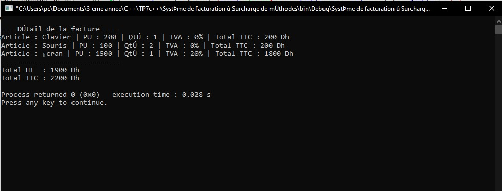

#  TP7 – Surcharge de Méthodes et Constructeurs en C++

##  Cours : Programmation Orientée Objet (C++)

---

##  Objectif général
L’objectif de ce TP est de maîtriser la **surcharge de constructeurs** et de **méthodes** en C++.  
Ces mécanismes permettent d’adapter le comportement d’une classe selon les informations disponibles, d’améliorer la flexibilité du code et d’implémenter des logiques métier plus réalistes.

---

##  Exercice 1 — Gestion d’un carnet d’adresses

###  Objectif
Créer une classe `Contact` représentant une fiche de contact et illustrant la **surcharge de constructeurs**.

###  Spécifications techniques
**Attributs privés :**
- `std::string nom`
- `std::string telephone`
- `std::string email`

**Constructeurs surchargés :**
1. `Contact(string n)` → Nom uniquement  
2. `Contact(string n, string t)` → Nom + téléphone  
3. `Contact(string n, string t, string e)` → Nom + téléphone + email  

**Méthode :**
- `void afficher()` → Affiche les informations du contact.

## Résultat visuel

  
<em>Figure 1 </em>
 

##  Exercice 2 — Système de facturation (Surcharge de méthodes)
###Objectif

Mettre en œuvre la surcharge de méthode ajouterArticle() pour ajouter des articles à une facture de plusieurs façons.

### Spécifications techniques

-Attributs privés :

`std::vector<Article> articles`

-Structure Article :

`nom`,` prixUnitaire`,` quantite`,` tva`

-Méthodes surchargées :

`ajouterArticle(string nom, double prix)`

`ajouterArticle(string nom, double prix, int quantite)`

`ajouterArticle(string nom, double prix, int quantite, double tva)`

-Méthode :

`afficherTotal()` → Affiche la liste des articles et le total HT/TTC.

## Résultat visuel

  
<em>Figure 2 </em>
 

## Exercice 3 — Banque (Constructeurs et Méthodes surchargés)
## Objectif

Créer une classe CompteBancaire permettant d’ouvrir un compte avec ou sans solde initial, et de réaliser des retraits avec ou sans code de sécurité.

## Spécifications techniques

-Attributs privés :

`std::string titulaire`

`double solde`

`std::string codeSecurite`

-Constructeurs surchargés :

`CompteBancaire(string nom` → Compte vide (solde = 0 Dh)

`CompteBancaire(string nom, double s)` → Compte avec solde initial

`CompteBancaire(string nom, double s, string code) `→ Compte sécurisé

-Méthodes surchargées :

`retrait(double montant) `→ Retrait simple

`retrait(double montant, string code)` → Retrait sécurisé (vérifie le code)

-Méthode :

`afficherSolde() `→ Affiche le solde actuel du compte.

##  Résultat visuel

  
<em>Figure 3 </em>
 

### Concepts clés abordés

-Surcharge de constructeurs

-Surcharge de méthodes

-Polymorphisme statique

-Adaptation du comportement selon les paramètres

-Encapsulation et logique métier

### Environnement de développement

-Langage : C++ (standard ≥ C++11)

-Compilateur : GCC / g++

-IDE recommandé : Code::Blocks, Visual Studio Code, Eclipse CDT
